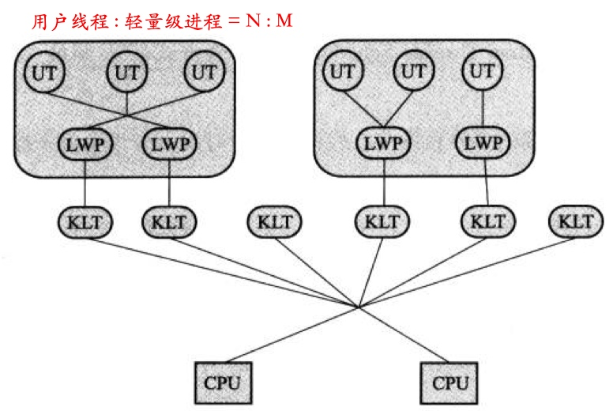

# Java 线程：原理篇

<!-- TOC -->

- [Java 线程：原理篇](#java-线程原理篇)
    - [线程的调度](#线程的调度)
    - [线程的实现原理](#线程的实现原理)
        - [三种线程的实现方式](#三种线程的实现方式)
            - [使用内核线程实现](#使用内核线程实现)
                - [优点和缺点](#优点和缺点)
            - [使用用户线程实现](#使用用户线程实现)
                - [优点和缺点](#优点和缺点-1)
            - [使用用户线程加轻量级进程](#使用用户线程加轻量级进程)
        - [Java 线程的实现](#java-线程的实现)

<!-- /TOC -->

## 线程的调度

- **协同式线程调度：** 线程的执行时间由线程本身来控制，线程执行完自己的任务之后，主动通知系统切换到另一个线程。
  - **优点：**实现简单，没有线程同步的问题。
  - **缺点：**线程执行时间不可控，如果一个线程编写有问题一直无法结束，程序会一直阻塞在那里。
- **抢占式线程调度：** 每个线程由系统分配执行时间，系统决定切不切换线程。
    - Java 使用的线程调度方式就是这种！（鬼知道你会把程序写成什么样子，所以还是安全第一）

## 线程的实现原理

### 三种线程的实现方式

#### 使用内核线程实现

内核线程（KLT），就是直接由操作系统支持的线程，不过当然不是我们的程序可以直接去操作操作系统的进程（那样实在是太危险了），而是程序可以通过调用内核线程的一种高级接口 —— 轻量级进程（LWP），来操作内核进程。也就是说，LWP 和 KLT 之间是 1:1 的关系，因此我们也称这种模型为一对一的线程模型。

这类似于一种代理模式，LWP 就是代理对象，而 KLT 则是被代理对象，我们把任务请求发给代理人 LWP，然后 LWP 会通过调用真实具备执行任务能力的被代理人 KLT 去执行任务。

##### 优点和缺点
- **优点：**
    - 每个 LWP 都是一个独立的调度单元，即便有一个 LWP 在调用过程中阻塞了，也不会影响整个进程继续工作，系统的稳定性会比较好。
    - 线程的调度和各种操作都委托给了操作系统，所以实现上比较简单。
- **缺点：**
    - 各种线程操作（创建、析构、同步等）都需要进行系统调用，而系统调用的代价较高，需要在用户态和内核态中来回切换，这会消耗掉一些时间。
    - 每个 LWP 都需要一个 KLT 支持，也就是说，每个 LWP 都会消耗掉一部分内核资源（内核线程和栈空间），因此系统可以支持的 LWP 数量是有限的。

> 在早期的 Linux 系统里，是没有线程支持的，也就是说，操作系统的资源分配单元是进程，执行单元也是进程（不像现在的执行单元是线程），相当于每个进程都是单线程的。每个进程还是像现在这样，有自己的内存、文件描述符和 I/O 端口等，其他进程不能访问你的，同时你也不能访问其他进程的。然后每个进程在 CPU 上分时执行。
>
> 后来，人们发现并发程序的好了，觉得以进程为执行单元有点太繁琐了，每次切换执行单元需要切换的上下文太多了，于是就引入了线程的实现。
>
> 其实线程的概念很在就有了，不过在操作系统中大规模使用要比概念的提出完了 20 年左右。

#### 使用用户线程实现

狭义上，用户线程（UT）指的是完全建立在用户空间的线程，即操作系统是感知不到线程的存在的，它只知道那个掌管着这些 UT 的进程 P。因此，进程和 UT 之间的比例为 1:N。

##### 优点和缺点
- **优点：**
    - UT 的创建、同步、销毁、调度都是在用户态完成的，完全不需要切换到内核态，因此各种线程操作可以是非常快速和低消耗的。
    - 由于进程和 UT 之间的比例为 1:N，所以可以支持更大规模的 UT 数量。
- **缺点：**
    - 由于没有系统内核的支持，所以所有的线程操作都需要自己实现，这就使得 UT 的实现程序一般都比较复杂，而且事实证明，我们很难实现的比操作系统好。
        - 现在使用 UT 的程序越来越少了，Java 和 Ruby 等语言都曾使用过 UT ，最后都放弃了...

#### 使用用户线程加轻量级进程

这种模式下，既存在用户线程，也存在轻量级线程。在这种模型下：
- UT 还是只存在于用户空间，因此线程的创建、同步、销毁的消耗依旧很小，同时也可以支持很多线程并发。
- 对于线程的调度，则通过 LWP 作为 UT 和 KLT 之间的桥梁，这样就可以使用操作系统提供的线程调度功能和处理器映射了。
- UT 的系统调用要通过 LWP 完成，大大降低了整个进程被完全阻塞的风险。
- UT 和 LWP 之间的比例是不确定的，即为 N:M 的关系。

> 一些 UNIX 操作系统提供了 N:M 线程模型的实现，如 Solaris、HP-UX，不过一般并不主流。

### Java 线程的实现

根据上一节的描述，是不是看起来后两种实现方法从原理上讲更好、更高级、更牛逼的样子，不过实际情况可能和我们想的不太一样，复杂的实现往往会带来更多的问题（这是因为，想要体现复杂方法的优势，首先需要它能被完美的执行，而由于其复杂性，如何让它完美的执行这个事情本身，就是一个问题），所以有时候，往往是那些效率并没有被发挥到极致的简单方法，更受大家青睐。

JDK 1.2 之前，Java 线程是基于名为 Green Thread 的用户线程实现的，JDK 1.2 之后，被替换为基于操作系统原生线程模型来实现。对于目前的 JDK 版本，这将取决于操作系统支持怎样的线程模型，虚拟机规范中并没有规定 Java 线程必须使用哪种线程模型来实现。

对于 Sun JDK，它的 Windows 和 Linux 平台使用的都是 1:1 的线程模型，即第一种线程实现方式，每条 Java 线程都会被映射进一条轻量级进程中，因为 Windows 和 Linux 系统提供的线程模型就是一对一的。

看起来还是简单的实现更易掌控，更受欢迎呀！这也很符合 Unix 小而美的哲学呀~

 

上一篇：[Java线程：使用篇](./01-Java线程-使用篇.md)

---

参考文章：
- [深入聊聊java线程模型实现？ - 海纳的回答 - 知乎](https://www.zhihu.com/question/263955521/answer/296521081)