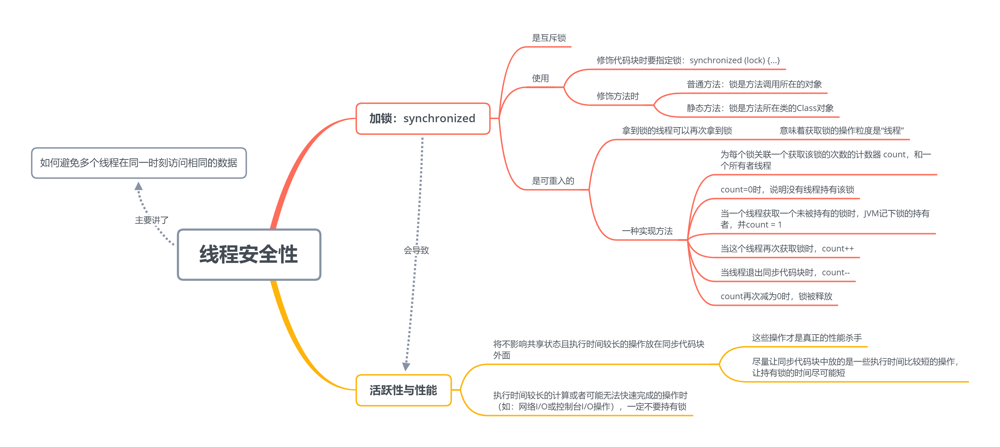

# 线程的安全性

<!-- TOC -->

- [线程的安全性](#%E7%BA%BF%E7%A8%8B%E7%9A%84%E5%AE%89%E5%85%A8%E6%80%A7)
  - [加锁：synchronized](#%E5%8A%A0%E9%94%81synchronized)
    - [使用方法](#%E4%BD%BF%E7%94%A8%E6%96%B9%E6%B3%95)
    - [synchronized 锁是可重入的](#synchronized-%E9%94%81%E6%98%AF%E5%8F%AF%E9%87%8D%E5%85%A5%E7%9A%84)
    - [如何减小 synchronized 对应用性能的影响](#%E5%A6%82%E4%BD%95%E5%87%8F%E5%B0%8F-synchronized-%E5%AF%B9%E5%BA%94%E7%94%A8%E6%80%A7%E8%83%BD%E7%9A%84%E5%BD%B1%E5%93%8D)
    - [synchronized 的原理](#synchronized-%E7%9A%84%E5%8E%9F%E7%90%86)
      - [对象头](#%E5%AF%B9%E8%B1%A1%E5%A4%B4)
      - [Monitor Record](#monitor-record)
    - [锁优化](#%E9%94%81%E4%BC%98%E5%8C%96)
      - [偏向锁](#%E5%81%8F%E5%90%91%E9%94%81)
      - [轻量级锁](#%E8%BD%BB%E9%87%8F%E7%BA%A7%E9%94%81)

<!-- /TOC -->

线程安全性主要解决了如何避免多个线程在同一时刻访问同一个数据的问题，它主要通过加锁的方式，使得多个线程排成一队，一个一个的访问数据，也是由于这个原因，通过这种方式保证线程安全会对应用的性能产生影响。

## 加锁：synchronized

synchronized 是互斥锁，也就是说，在同一时刻，它只允许一个线程拿到锁对象，它有如下两种使用方法：

### 使用方法

**修饰代码块：**

```java
synchronized (lock对象) {
    // 同步代码块
}
```

**修饰方法：**

修饰普通方法：（锁是调用方法的对象）

```java
synchronized public void getValue() {...}
```

修饰静态方法：（锁是该方法所在的 Class 对象）

```java
synchronized public static void getValue() {...}
```

### synchronized 锁是可重入的

拿到锁的线程可以再次拿到锁，这意味着获取锁的操作粒度是“线程”。

**可重入锁的一种实现方式：**

- 为每个锁关联一个获取该锁的次数的计数器 count，和一个所有者线程；
- count=0时，说明没有线程持有该锁；
- 当一个线程获取一个未被持有的锁时，JVM 记下锁的持有者，并 count = 1；
- 当这个线程再次获取锁时，count++；
- 当线程退出同步代码块时，count--；
- 当 count 再次减为 0 时，锁被释放。

### 如何减小 synchronized 对应用性能的影响

- 将不影响共享状态且执行时间较长的操作放在同步代码块外面，尽量让同步代码块中放的是一些执行时间比较短的操作，让持有锁的时间尽可能短。
- 执行时间较长的计算或者可能无法快速完成的操作时（如：网络I/O或控制台I/O操作），一定不要持有锁！


### synchronized 的原理

JVM是基于进入和退出Monitor对象来实现方法同步和代码块同步的。代码块的同步是通过`monitorenter`和`monitorexit`实现的，方法同步使用的是另一种方式，细节在JVM规范中并没有详细说明。

`monitorenter`会被插入到同步代码块开始的位置，而`monitorexit`会被插入到方法结束的位置或者异常处（并不是同步代码块结束的位置），JVM保证每个`monitorenter`都会有一个`monitorexit`与之对应。

当一个线程执行到`monitorenter`指令时，会尝试获取对象对应的monitor的所有权，任何对象都有一个monitor与之关联，当一个monitor被持有后，该对象所保护的区域将处于锁定状态，因为其他线程这时不能持有monitor。

那么接下来问题来了，锁对象到底被存在哪里呢？synchronized用的锁是存在Java对象的对象头中的，我们先来介绍一下对象头是什么。

#### 对象头

Java的对象头主要包含几部分：
| 长度      | 内容                   | 说明                       |
| --------- | ---------------------- | -------------------------- |
| 32/64 bit | Mark Word              | 存储对象的hashCode和锁信息 |
| 32/64 bit | Class Metadata Address | 存储对象类型数据的指针     |
| 32 bit    | Array length           | 数组的长度（数组对象才有） |


#### Monitor Record

Monitor Record是线程私有的数据结构，每一个线程都有一个可用monitor record列表，同时还有一个全局的可用列表。每一个被锁住的对象都会和一个monitor record关联（对象头的MarkWord中的LockWord指向monitor record的起始地址），同时monitor record中有一个Owner字段存放拥有该锁的线程的唯一标识，表示该锁被这个线程占用。

如下为Monitor Record的内部结构：

|monitor record 元素|说明|
|-|-|
|**Owner**|初始时为null,表示当前没有任何线程拥有该monitor，当线程成功拥有该锁后保存线程唯一标识，当锁被释放时又设置为null|
|EntryQ|阻塞所有试图锁住monitor record失败的线程|
|RcThis|表示blocked或waiting在该monitor record上的所有线程的个数|
|**Nest**|实现重入锁的计数|
|HashCode|保存从对象头拷贝过来的HashCode值|
|Candidate|0表示没有需要唤醒的线程，1表示要唤醒一个继任线程来竞争锁|

### 锁优化

#### 偏向锁

**引入背景：**
大多数情况下，锁不仅不存在竞争，而且总是由同一个线程多次获得，为了让线程获得锁的代价更低而引入了偏向锁。

**加锁过程：** 
- 当一个线程访问同步块并获取锁时，会在对象头和栈帧中的锁记录里存储锁偏向的线程ID，以后该线程在进入和退出同步块时不需要花费CAS操作来加锁和解锁，而只需简单的测试一下对象头的Mark Word里是否存储着指向当前线程的偏向锁
- 如果测试成功，表示线程已经获得了锁
- 如果测试失败，则需要再测试下Mark Word中偏向锁的标识是否设置成1（表示当前是偏向锁）
- 如果没有设置，则使用CAS竞争锁，如果设置了，则尝试使用CAS将对象头的偏向锁指向当前线程


#### 轻量级锁

[TODO](TODO)


**参考**
- https://blog.csdn.net/u012465296/article/details/53022317 
- https://blog.csdn.net/chenssy/article/details/54883355

