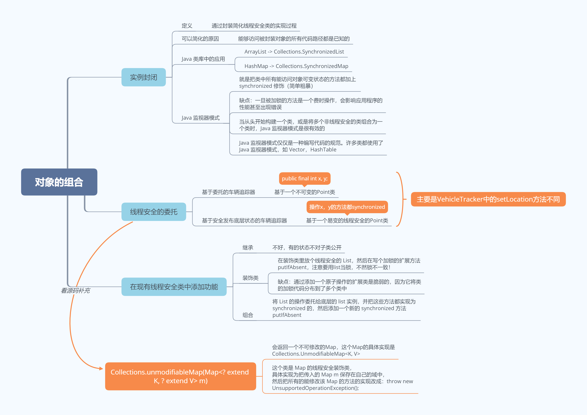

<!-- TOC -->

- [如何构造线程安全类](#如何构造线程安全类)
    - [实例封闭](#实例封闭)
        - [在 Java 类库中的应用](#在-java-类库中的应用)
        - [Java 监视器模式](#java-监视器模式)
    - [线程安全的委托](#线程安全的委托)
        - [示例：构建线程安全的车辆追踪器及优化](#示例构建线程安全的车辆追踪器及优化)
            - [第一种思路：把 Point 变为一个不可变对象](#第一种思路把-point-变为一个不可变对象)
            - [第二种思路：构建一个可变但是线程安全的 Point 类](#第二种思路构建一个可变但是线程安全的-point-类)
    - [如何在现有线程安全类中添加功能](#如何在现有线程安全类中添加功能)
        - [方法一：继承（extends）](#方法一继承extends)
        - [方法二：装饰类](#方法二装饰类)
        - [方法三：组合（最好）](#方法三组合最好)

<!-- /TOC -->

# 如何构造线程安全类

## 实例封闭

通过封装简化线程安全类的实现过程，因为封装之后，能够访问被封装对象的所有代码路径都是已知的，即通过封装限制对象被访问的方式。

### 在 Java 类库中的应用

- `ArrayList -> Collections.SynchronizedList`
- `HashMap -> Collections.SynchronizedMap`

这些类把线程不安全类封装到自己内部，然后将所有的接口方法都实现为同步方法（加上synchronized关键字修饰），并将调用请求转发到底层容器上（就是调用它封装进去的线程不安全类的相应方法），相当于给线程不安全类所有暴露在外的线程不安全方法都加上了synchronized修饰，是装饰者模式的一种应用。

### Java 监视器模式

就是把类中所有能访问对象可变状态的方法都加上 synchronized 修饰（简单粗暴），虽然简单，但是一旦被加锁的方法是一个费时操作，会影响应用程序的性能甚至出现错误。以下是一个 Java 监视器模式的典型例子：

```java
/* Java监视器模式的典型例子 */
public class Counter {
    private long value = 0;

    public synchronized long getValue() {
        return value;
    }

    public synchronized long increment() {
        if (value == Long.MAX_VALUE) {
            throw new IllegalStateException("counter overflow");
        }
        return ++value;
    }
}
```


## 线程安全的委托

### 示例：构建线程安全的车辆追踪器及优化

接下来，我们将使用下面这个车辆追踪器的示例对本节内容进行讲解，下面的这个只是一个初级版，在之后讲解了新的方法之后，我们会在这个初级的版本上得到两种进化版本。

首先，我们有一个线程不安全的 Point 类，用来表示车辆的坐标。

```java
public class MutablePoint {
    public int x, y;

    public MutablePoint() {
        x = 0;
        y = 0;
    }

    public MutablePoint(MutablePoint p) {
        this(p.x, p.y);
    }

    public MutablePoint(int x, int y) {
        this.x = x;
        this.y = y;
    }
}
```

先使用 Java 监视器模式，即简单粗暴的在所有会改变 MonitorVehicleTracker 的 locations 域的方法上都加上 synchronized 修饰，来达到线程安全的目的。

```java
public class MonitorVehicleTracker {
    private final Map<String, MutablePoint> locations;

    public MonitorVehicleTracker(Map<String, MutablePoint> locations) {
        this.locations = deepCopy(locations);
    }

    public synchronized Map<String, MutablePoint> getLocations() {
        // 当locations比较大时，这步是一个耗时操作，会长时间占用锁
        // 会出现车辆位置已变，但返回信息保持不变的错误
        return deepCopy(locations);
    }

    public synchronized MutablePoint getLocation(String id) {
        MutablePoint loc = locations.get(id);
        return loc == null ? null : new MutablePoint(loc);
    }

    public synchronized void setLocation(String id, int x, int y) throws IllegalAccessException {
        MutablePoint loc = locations.get(id);
        if (loc == null) {
            throw new IllegalAccessException("No such ID: " + id);
        }
        loc.x = x;
        loc.y = y;
    }

    // 当locations.size()比较大时，这个方法将会是一个十分费时的操作
    public static Map<String, MutablePoint> deepCopy(Map<String, MutablePoint> m) {
        Map<String, MutablePoint> result = new HashMap<String, MutablePoint>();
        for (String id : m.keySet()) {
            result.put(id, m.get(id));
        }
        return result;
    }
}
```

这个车辆追踪器最大的问题就是 Point 类是一个易变的线程不安全类，这导致我们不得不在 MonitorVehicleTracker 中加入大量的同步代码，所以我们考虑从修改 Point 类入手（所以说，构建大的线程安全模块，应该从构建小的线程安全模块入手），对于这个错误，我们有两种解决思路：

- 直接把 Point 变为一个不可变对象；
- 构建一个可变但是线程安全的 Point 类，即给 Point 类中的 get 和 set 方法上加上同步，然后我们在 MonitorVehicleTracker 中就不用再使用同步了，相当于缩小了同步代码块的大小。

#### 第一种思路：把 Point 变为一个不可变对象

我们修改 Point 类如下：

```java
public class ImmutablePoint {
    public final int x, y;

    public ImmutablePoint(int x, int y) {
        this.x = x;
        this.y = y;
    }
}
```

我们可以在车辆追踪器中这样使用：

```java
public class DelegatingVehicleTracker {
    private final Map<String, ImmutablePoint> locations;
    private final Map<String, ImmutablePoint> unmodifiableMap;

    public DelegatingVehicleTracker(Map<String, ImmutablePoint> pointMap) {
        // 通过使用ConrentHashMap来保证locations的读写安全
        locations = new ConcurrentHashMap<String, ImmutablePoint>(pointMap);
        unmodifiableMap = Collections.unmodifiableMap(locations);
    }

    public Map<String, ImmutablePoint> getLocations() {
        return unmodifiableMap;
    }

    public ImmutablePoint getLocation(String id) {
        return locations.get(id);
    }

    public void setLocation(String id, int x, int y) throws IllegalAccessException { // 不同！
        // 这里直接new一个新的ImmutablePoint对象替代原理的对象
        if (locations.replace(id, new ImmutablePoint(x, y)) == null) {
            throw new IllegalAccessException("No such ID: " + id);
        }
    }
}
```

> **看源码补充：`Collections.unmodifiableMap(Map<? extend K, ? extend V> m)`**
>
> - 返回一个不可修改的Map，这个 Map 的实现是`Collections.unmodifiableMap(Map<? extend K, ? extend V> m)`
> - 这个类是 Map 的线程安全装饰类，具体实现为把传入的 Map m 保存在自己的域中，然后把所有的能修改该 Map 的方法的实现改成：`throw new UnsupportedOperationException();`

#### 第二种思路：构建一个可变但是线程安全的 Point 类

把 Point 变成是线程安全的可变类：

```java
public class SafePoint {
    private int x, y;

    public SafePoint(int[] a) {
        this(a[0], a[1]);
    }

    public SafePoint(SafePoint point) {
        this(point.get());
    }

    public SafePoint(int x, int y) {
        this.x = x;
        this.y = y;
    }

    public synchronized int[] get() {
        return new int[]{x, y};
    }

    public synchronized void set(int x, int y) {
        this.x = x;
        this.y = y;
    }
}
```

PublishingVehicleTracker 实现：

```java
public class PublishingVehicleTracker {
    private final Map<String, SafePoint> locations;
    private final Map<String, SafePoint> unmodifiableMap;

    public PublishingVehicleTracker(Map<String, SafePoint> pointMap) {
        locations = new ConcurrentHashMap<String, SafePoint>(pointMap);
        unmodifiableMap = Collections.unmodifiableMap(locations);
    }

    public Map<String, SafePoint> getLocations() {
        return unmodifiableMap;
    }

    public SafePoint getLocation(String id) {
        return locations.get(id);
    }

    public void setLocation(String id, int x, int y) throws IllegalAccessException { // 不同！
        // 因为Point已经改成线程安全的了，我们可以通过Point自己的set和get方法放心大胆的修改它
        SafePoint loc = locations.get(id);
        if (loc == null) {
            throw new IllegalAccessException("No such ID: " + id);
        }
        loc.set(x, y);
    }
}
```


## 如何在现有线程安全类中添加功能

### 方法一：继承（extends）

不好，因为有的状态不对子类公开。

### 方法二：装饰类

在装饰类里放个线程安全的 List，然后在写个加锁的扩展方法 putIfAbsent，注意要用 list 当锁，不然锁不一致！

```java
public class ListHelper<E> {
    public List<E> list = Collections.synchronizedList(new ArrayList<E>());

    public boolean putIfAbsent(E x) {
        synchronized (list) {
            boolean contains = list.contains(x);
            if (!contains) {
                list.add(x);
            }
            return !contains;
        }
    }
}
```

**缺点：**通过添加一个原子操作的扩展类是脆弱的，因为它将类的加锁代码分布到了多个类中

- List 原有方法的加锁代码在 Collections.SynchronizedList 的代码中

- 新加的 putIfAbsent 方法的加锁代码在 ListHelper 中

### 方法三：组合（最好）

将 List 的操作委托给底层的 list 实例，并把这些方法都实现为 synchronized 的，然后添加一个新的 synchronized 方法putIfAbsent，然后客户代码不会再直接使用 list 对象，而是通过 ImproveList 来操纵它，这样加锁代码就都在一个类中了，同时底层的 list 实现也不用必须是线程安全的。（就是要写的代码有点多……）

```java
public class ImproveList<E> implements List<E> {
    private final List<E> list;

    public ImproveList(List<E> list) {
        this.list = list;
    }

    public synchronized boolean putIfAbsent(E x) {
        boolean contains = list.contains(x);
        if (!contains) {
            list.add(x);
        }
        return !contains;
    }

    /* 剩下的是List本来的方法，都加上synchronized，然后内部调用底层list实现 */
    @Override
    public synchronized int size() {
        return list.size();
    }
    // ...
}
```

